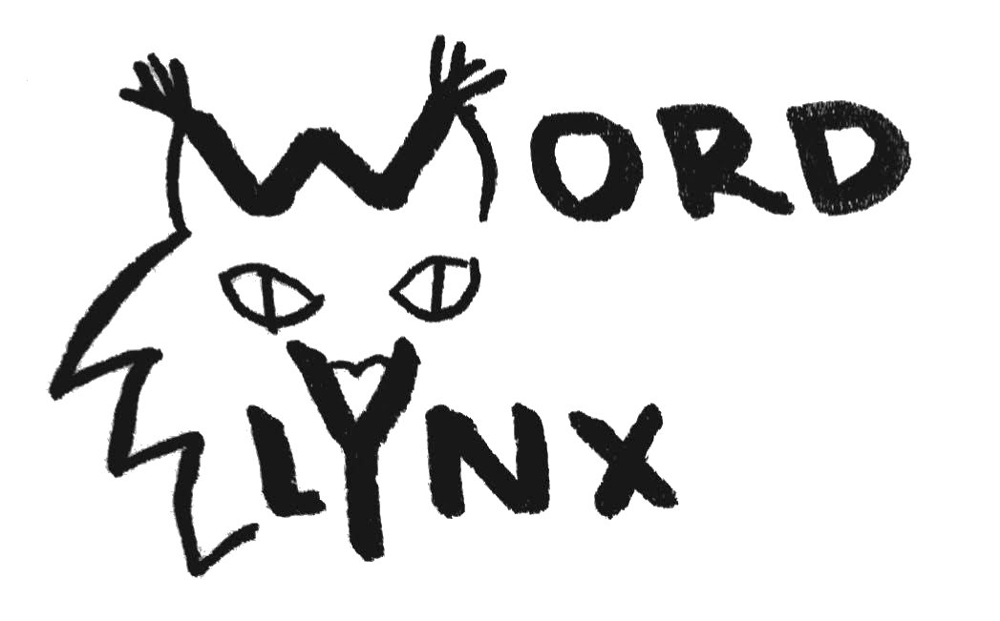

# 

  

## Mapping & communication made easy with human-readable geocoding

Index Locations, create memorable addresses, simplify data recording, and more with human-readable geocodes. 

[**Take me there now -->**](https://hcvdb.med.ubc.ca/useful-links/wlns/)

## A concept in the making

*Transformative:* three words and a number make any location easy to remember

*Flexible:* lighweight, and easily integrated into exising platforms

*Adaptable:* interpret any alphanumeric string with WordLynx

***FREE*** open access for anyone, anywhere

## Vision

We see WordLynx as a useful resource, ready to capture the imagination of app designers around the world.

Its intuitive simplicity lends it an unrealized
dimension to improver user experience. 

Check it out and join the effort to address the
world and more!!

